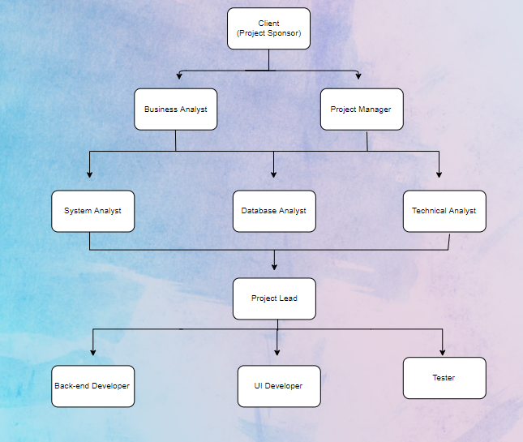

# &nbsp;&nbsp;&nbsp;&nbsp;&nbsp;&nbsp;&nbsp;&nbsp;&nbsp;&nbsp;&nbsp;&nbsp;&nbsp;&nbsp;&nbsp;&nbsp;&nbsp;&nbsp;&nbsp;&nbsp;&nbsp;&nbsp;&nbsp;&nbsp;&nbsp;&nbsp;&nbsp;&nbsp;&nbsp;&nbsp;&nbsp;&nbsp;Project Management Plan
## &nbsp;&nbsp;&nbsp;&nbsp;&nbsp;&nbsp;&nbsp;&nbsp;&nbsp;&nbsp;&nbsp;&nbsp;&nbsp;&nbsp;&nbsp;&nbsp;&nbsp;&nbsp;&nbsp;&nbsp;&nbsp;&nbsp;&nbsp;&nbsp;&nbsp;&nbsp;&nbsp;&nbsp;&nbsp;&nbsp;&nbsp;&nbsp;&nbsp;&nbsp;&nbsp;&nbsp;&nbsp;&nbsp;&nbsp;&nbsp;&nbsp;&nbsp;&nbsp;&nbsp;&nbsp;&nbsp; Learning Tool Development
### Prepared by:  Vamshi Krishna Yellamanchili &nbsp;&nbsp;&nbsp;&nbsp;&nbsp;&nbsp;&nbsp;&nbsp;&nbsp;&nbsp;&nbsp;&nbsp;&nbsp;&nbsp;&nbsp;&nbsp;&nbsp;&nbsp;&nbsp;&nbsp;&nbsp;&nbsp;&nbsp;&nbsp;&nbsp;&nbsp;&nbsp;&nbsp;&nbsp;&nbsp;&nbsp;&nbsp;&nbsp;&nbsp;&nbsp;&nbsp;&nbsp;&nbsp;&nbsp;&nbsp;&nbsp;&nbsp;&nbsp;&nbsp;&nbsp;&nbsp;&nbsp;&nbsp;&nbsp;&nbsp;&nbsp;&nbsp;&nbsp;&nbsp;&nbsp;&nbsp;&nbsp;&nbsp;&nbsp;&nbsp;&nbsp;Date: 05/27/2018
 
## 1. Overview:
Origin Info Tech are leading software developing company. There are well known for their interactive website development. Amrita Sai Educational Institutions, Vijayawada requested them for developing an interactive website for learning Project Management in Business and Technology course especially concentrating on ten knowledge areas and five process groups along with 49 processes. The website should be interactive for students in learning 49 process groups
 
## 2. Project Deliverables:
Project Charter, Project Management Plan, Requirements Specifications, Scope Statement, Work Breakdown Structure, Gantt Charts, Budget Plan, Stakeholder Register, Each Phase Status Reports, Project Documentation, Tasks log and lessons learnt documentation are the important deliverables.
 
## 3. Scope Statement: 
Design and Develop an Interactive website for learning Project Management. It mainly focuses on knowledge areas and process groups. The application should meet all requirements like poster for each knowledge area on home page, quiz module and matrix describing each processes

## 4. Project Milestones:
Milestone|Description|Date|
---|---|---|
Milestone-01 |Get all requirements, develop user login page. |06/20/2019|
Milestone-02 |Develop Each static page for seperately for each Knowledge Area |06/30/2019|
Milestone-03 |Develop Quizzes and grade modules |07/10/2019|
Milestone-04 |Develop grid explanining each processes and hand over project |07/17/2019|
 
## 5. Organizational Structure:

## 6. Roles and Responsibilities:

<table>
  <tr>
    <th>Role</th>
    <th>Name</th>
    <th>Organization/Position</th>
    <th>Contact Information</th>
  </tr>
  <tr>
    <td>Project Manager</td>
    <td>Ravi Kumar Atluri</td>
    <td>PMO</td>
    <td>6605280971</td>
  </tr>
  <tr>
    <td>Team Leader</td>
    <td>Vamshi Krishna Yellamanchili</td>
    <td>Lead</td>
    <td>6608530667</td>
  </tr>
  <tr>
    <td>Team Member</td>
    <td>Sandeep Devineni</td>
    <td>Development</td>
    <td>6605280760</td>
  </tr>
  <tr>
    <td>Client</td>
    <td>Midhun Kandakatla</td>
    <td>User</td>
    <td>6608530237</td>
  </tr>
</table>
 

## 7. Project Scope Management
Following are artifacts of scope management
- [Requirement Specification.](https://github.com/ravikumaratluri/project-management-team-06/blob/master/docs/Project%20Scope%20Management/requirement-specifications.md "Requirement Specification")
- [Scope statement.](https://github.com/ravikumaratluri/project-management-team-06/blob/master/docs/Project%20Scope%20Management/scope-statement.md "Scope Statement")
- [Work Breakdown structure (WBS).](https://github.com/ravikumaratluri/project-management-team-06/blob/master/docs/Project%20Scope%20Management/work-breakdown-structure.png "Work Breakdown Structure")

## 8. Project Schedule Management
Following are artifacts of schedule management
- [Gantt Chart.](https://github.com/ravikumaratluri/project-management-team-06/blob/master/docs/Project%20Schedule%20Management/gantt-chart.PNG "Gantt Chart")
- [Schedule Tasks.](https://github.com/ravikumaratluri/project-management-team-06/blob/master/docs/Project%20Schedule%20Management/tasks-schedule.PNG "Schedule")
- [Complete Project Plan.](https://github.com/ravikumaratluri/project-management-team-06/blob/master/docs/Project%20Schedule%20Management/Interactive%20Learning%20Website.pod "Complete Project Plan")

## 9. Project Cost Management

Project Cost Management includes the processes required to ensure that the project is completed within the approved budget. Following are major processes:
1. Planning Resources — It determines which resources (material,people,equipment) and in which quantities these should be used to perform project activities.
2. Estimating the Cost — It estimates costs of the resources required to complete the project approximately.
3. Cost Budget — It gives the individual overall cost estimate to work items.
4. Controlling the cost — It controls the changes done to the project.

The budget of the project is $1,449,996.The project manager will allocate the budget to each and every department accordingly based on the requirements by each department. 
26% of total budget is allocated to project management,7% for hardware and 38% for software.Most of the project budget is allocated for software developement.
## Detailed Cost Estimation and Budget:
The detailed cost estimation is in the below link:   
https://docs.google.com/spreadsheets/d/1uKbGP7kXAaTCLkaxeJrtNZmCfCQFIdK3Zl5INwi0akU/edit?usp=sharing
 

